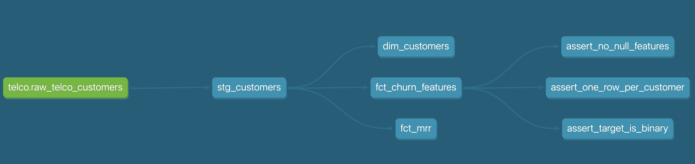

# Subscription Analytics — dbt Project

A dbt analytics pipeline that transforms raw customer subscription data
into a clean, tested, ML-ready feature table for churn prediction.

Built to demonstrate analytics engineering fundamentals: source modelling,
staging discipline, mart design, ML-aware feature engineering, and
data quality testing.

---

## Business context

**Company:** NordSub — a Copenhagen-based B2B SaaS company offering three
subscription tiers to Nordic small businesses.

**Problem:** NordSub loses approximately 26.5% of its customer base annually.
Churn is only detected after it happens. The VP of Customer Success needs an
early warning system to flag at-risk customers 30 days before predicted churn
so the team can intervene with targeted retention offers.

**This project's role:** Produce a clean, tested feature table
(`fct_churn_features`) that serves as the direct input to a Churn 
prediction ML pipeline. Every modelling decision here is made with that downstream
use in mind.

---

## Project evolution

**v0.1 — seed prototype** (`tag: v0.1-seed-prototype`)
Built with 10 synthetic rows in CSV seeds to validate the dbt model structure
— staging, marts, and custom tests — before committing to a real dataset.

**v1.0 — current** (`branch: main`)
Migrated to the IBM Telco Customer Churn dataset (7,043 real customers) loaded
into DuckDB via `load_sources.py`. Seeds replaced with a proper source
definition. `fct_churn_features` is the primary deliverable, consumed by a Churn 
prediction ML pipeline via `export_features.py`.

See [`docs/development_log.md`](docs/development_log.md) for a full record of
decisions, findings, and deliberate trade-offs made during development.

---

## Business questions this project answers

- What is the MRR distribution across contract types, and where does churn
  hit hardest?
- Which customer profile signals — contract length, service usage, tenure —
  are most associated with churn?
- Is the feature table free of data quality issues that would corrupt a
  downstream ML model?

---

## Project structure

```
subscription_analytics/
  data/                        # Raw source files — gitignored
    Telco-Customer-Churn.csv
  docs/
    development_log.md         # Decision log: what changed, why, and what was found
    lessons_learned.md
  models/
    staging/
      sources.yml              # Registers raw_telco_customers as a dbt source
      schema.yml               # Tests on stg_customers
      stg_customers.sql        # Cleans and types raw Telco data
    marts/
      schema.yml               # Tests on all mart models
      dim_customers.sql        # One row per customer — profile and status
      fct_mrr.sql              # MRR aggregated by contract type
      fct_churn_features.sql   # ML-ready feature table — primary deliverable
  tests/
    assert_one_row_per_customer.sql
    assert_target_is_binary.sql
    assert_no_null_features.sql
  assets/
    dag2.png                   # dbt lineage graph
  load_sources.py              # Loads Telco CSV into DuckDB as raw_telco_customers
  export_features.py           # Exports fct_churn_features to exports/churn_features.csv
  dbt_project.yml
  README.md
```

---

## Lineage (DAG)



---

## How to run this project locally

**Requirements:** Python 3.11+, conda, dbt-duckdb

```bash
# Create and activate environment
conda create -n dbt_project python=3.11
conda activate dbt_project
pip install dbt-duckdb pandas

# Download the source data
# Place Telco-Customer-Churn.csv in the data/ folder
# Download from:
# https://raw.githubusercontent.com/IBM/telco-customer-churn-on-icp4d/master/data/Telco-Customer-Churn.csv

# Load raw data into DuckDB
python load_sources.py

# Build all models
dbt run

# Run all tests
dbt test

# Export the ML feature table
python export_features.py

# View documentation and lineage
dbt docs generate && dbt docs serve
```

---

## Testing approach

**Generic tests** on all primary keys across staging and marts
(`unique`, `not_null`, `accepted_values`).

**ML-quality custom tests** in `tests/` — these go beyond standard
dbt tests and enforce data quality rules specific to model training:

| Test | What it checks |
|---|---|
| `assert_one_row_per_customer` | No customer appears more than once in the feature table |
| `assert_target_is_binary` | `has_churned` is always exactly 0 or 1 |
| `assert_no_null_features` | Key ML features contain no nulls |

---

## Key design decision: total_charges excluded from features

The Telco source includes `total_charges` (cumulative customer spend).
This column is intentionally excluded from `fct_churn_features`.

`total_charges ≈ tenure_months × monthly_charges`. Including it alongside
both of those columns would introduce near-perfect multicollinearity and
create a proxy for the churn target — inflating model performance in ways
that do not generalise. `monthly_charges` is retained because it reflects
plan tier, a genuinely predictive signal that is known at prediction time.

Full rationale in [`docs/development_log.md`](docs/development_log.md).

---

## If this were production

**Swap the database:** The only change needed is in `profiles.yml`:

```yaml
type: bigquery      # instead of duckdb
project: my-project
dataset: analytics
```

All models, tests, and logic remain identical.

**Replace the loader:** `load_sources.py` is a local convenience script.
In production, `raw_telco_customers` would be populated by a scheduled
ingestion tool (Fivetran, Airbyte, or a custom pipeline). dbt's role —
transforming whatever lands in that table — stays the same.

**Scale the pipeline:**
- Add source freshness tests to detect when upstream data stops updating
- Move `fct_churn_features` to an incremental materialisation once
  the customer base grows beyond ~100k rows
- Add a monitoring layer that alerts on sudden churn rate spikes or
  unexpected nulls in the feature table

---

## Author

Victoria Cojocaru — [LinkedIn](https://www.linkedin.com/in/cojocaru-victoria/)
