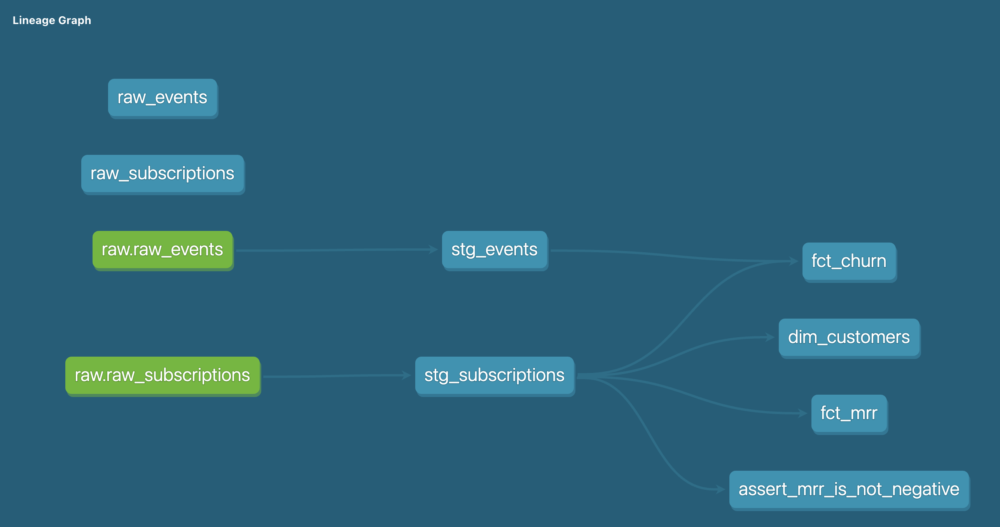

# Subscription Analytics — dbt Project

A dbt project that models raw subscription data into clean, 
tested, business-ready tables tracking churn, retention, and MRR.

Built to demonstrate analytics engineering fundamentals relevant 
to subscription lifecycle management.

---

## Business questions this project answers

- What is the monthly recurring revenue (MRR) broken down by plan?
- Which customers churned, when, and how long were they active?
- What is each customer's cohort month and current subscription status?

---

## Project structure

```
models/
  staging/        # Clean raw data. One model per source table.
    stg_subscriptions.sql
    stg_events.sql
  marts/          # Business logic. Used by analysts and ML pipelines.
    dim_customers.sql
    fct_mrr.sql
    fct_churn.sql
```

---

## Lineage (DAG)



---

## How to run this project locally

**Requirements:** Python 3.11+, conda

```bash
# Create environment
conda create -n dbt_project python=3.11
conda activate dbt_project
pip install dbt-duckdb

# Load raw data and build models
dbt seed
dbt run

# Run tests
dbt test

# View documentation
dbt docs generate && dbt docs serve
```

---

## Testing approach

- **Generic tests** on all primary keys (unique, not_null)
- **Accepted values** test on subscription status
- **Custom test** asserting MRR is never negative — catches upstream 
  data issues before they reach business users or ML models

---

## If this were production (BigQuery)

The only change needed is in `profiles.yml`:
```yaml
type: bigquery      # instead of duckdb
project: my-project
dataset: analytics
```

All models, tests, and logic remain identical.

To scale from 10 to 100 customers I would:
- Parameterize customer onboarding using dbt variables so each 
  customer's raw data schema maps cleanly to the same staging layer
- Add source freshness tests to catch when a customer's data pipeline 
  stops updating
- Move mart models from views to incremental models so we're not 
  reprocessing all historical data on every run
- Add a monitoring layer that alerts on sudden MRR drops or 
  unexpected churn spikes

---

## Author

Victoria Cojocaru — [LinkedIn](https://www.linkedin.com/in/cojocaru-victoria/)